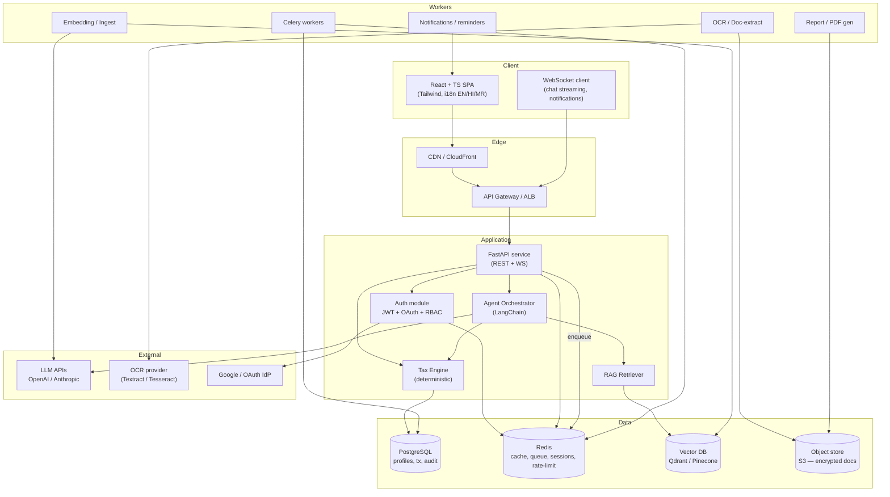
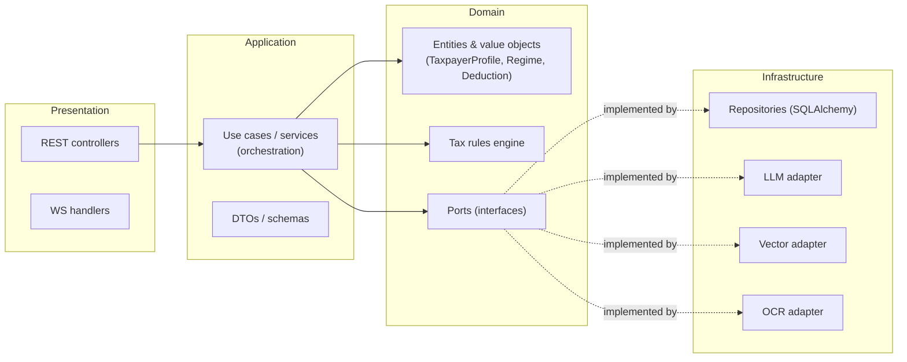
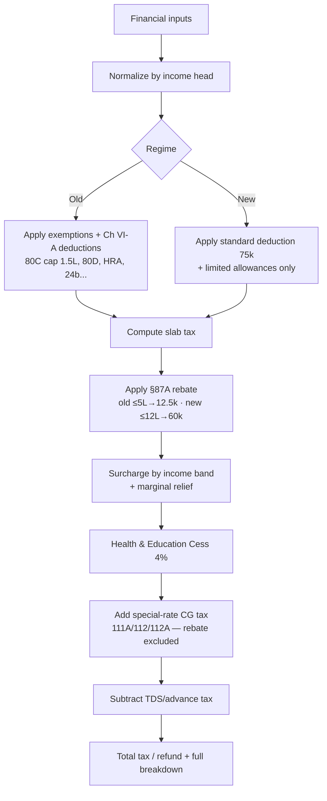
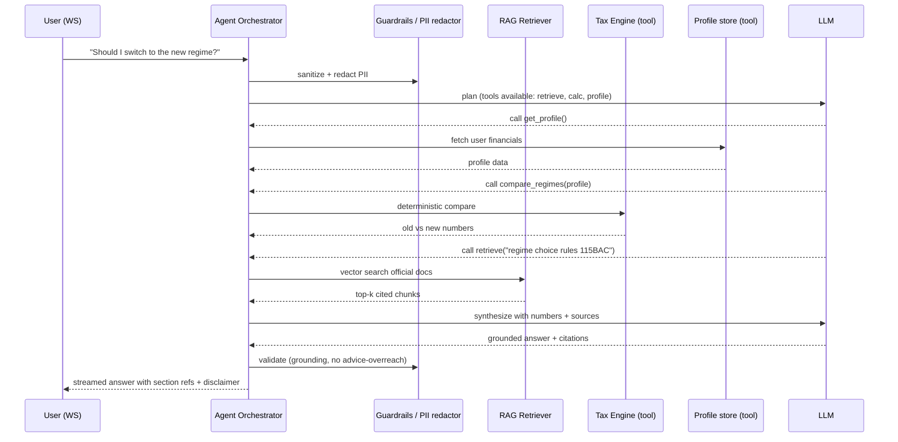
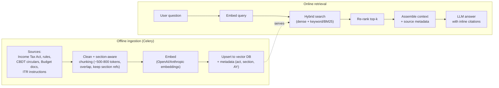
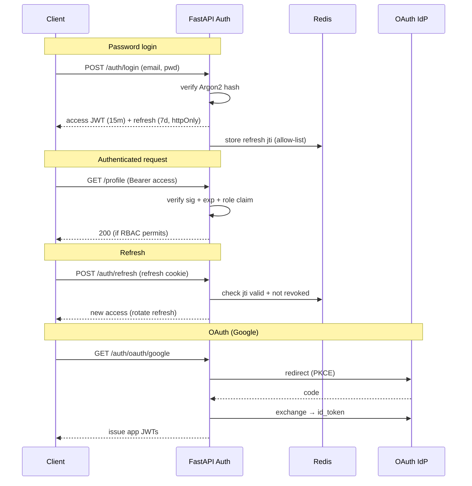
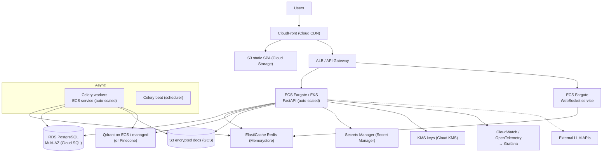
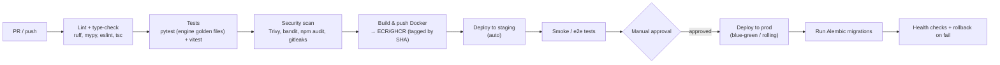

# AI Tax Optimizer (India) — System Architecture & Implementation Blueprint

A production-ready design for an AI-powered SaaS that helps Indian taxpayers legally reduce liability, compare regimes, understand the law, and get personalized, cited recommendations — built on FastAPI, React/TypeScript, LangChain agents, and RAG.

> **Tax-law currency note.** Slab rates, rebates, and deduction limits change with every Union Budget. This document uses **FY 2025-26 / AY 2026-27** rules (new-regime rebate under §87A up to ₹60,000 for taxable income ≤ ₹12 lakh; standard deduction ₹75,000 new / ₹50,000 old). **Never hardcode these.** The calculator must read all rates from versioned config keyed by assessment year, so a single data change handles each budget. This is a design blueprint — not tax advice — and the product must show a licensed-advisor disclaimer.

---

## Table of Contents
1. [Product Overview & Principles](#1-product-overview--principles)
2. [System Architecture](#2-system-architecture)
3. [Database Schema (ERD)](#3-database-schema-erd)
4. [API Design](#4-api-design)
5. [Tax Calculation Engine](#5-tax-calculation-engine)
6. [AI Agent Workflow](#6-ai-agent-workflow)
7. [RAG Pipeline](#7-rag-pipeline)
8. [Authentication, Authorization & RBAC](#8-authentication-authorization--rbac)
9. [Folder Structure](#9-folder-structure)
10. [Deployment Architecture](#10-deployment-architecture)
11. [CI/CD Pipeline](#11-cicd-pipeline)
12. [Security, Privacy & Compliance](#12-security-privacy--compliance)
13. [Implementation Roadmap](#13-implementation-roadmap)

---

## 1. Product Overview & Principles

### 1.1 What it does
| Capability | Description |
|---|---|
| Financial profile | Structured capture of salary, income heads, investments, loans, insurance, HRA, capital gains, deductions |
| Document AI | OCR + LLM extraction from Form 16, AIS/TIS, salary slips, bank statements (PDF/Excel/CSV/image) |
| Tax calculator | Old vs New regime, tax payable, refund, capital gains, TDS — deterministic, auditable |
| AI optimizer | Ranked, personalized tax-saving strategies with section refs, savings estimate, documents, deadlines |
| AI assistant (agent) | Grounded Q&A over official tax docs with citations; can invoke the calculator as a tool |
| Dashboard & analytics | Income/expense breakdown, allocation, tax summary, forecast, what-if simulator |
| Reports | AI-generated PDF tax reports, deadline reminders, audit-risk flags |

### 1.2 Architectural principles
- **Clean / hexagonal architecture** — domain logic isolated from FastAPI, ORM, and vendor SDKs behind ports/adapters. LLM providers and vector DBs are swappable.
- **Determinism where it matters** — *all tax math is code, never the LLM.* The LLM explains and recommends; a rules engine computes. This is non-negotiable for a FinTech product.
- **Grounded generation only** — the assistant answers strictly from retrieved, cited sources; it refuses or hedges when unsupported.
- **Async-first** — heavy work (OCR, embedding, report generation) runs on Celery workers, never in the request path.
- **Privacy by design** — India's DPDP Act 2023 governs personal financial data; data residency in an Indian region, encryption everywhere, PII redaction before any third-party LLM call.

---

## 2. System Architecture

### 2.1 High-level component diagram



### 2.2 Layered (clean architecture) view



**Dependency rule:** arrows point inward. Domain knows nothing about FastAPI, SQLAlchemy, OpenAI, or Qdrant — those are infrastructure adapters bound to domain **ports** at startup via a DI container. Swapping Pinecone → Qdrant or OpenAI → Anthropic touches only one adapter.

---

## 3. Database Schema (ERD)

```mermaid
erDiagram
    USER ||--|| PROFILE : has
    USER ||--o{ INCOME_SOURCE : owns
    USER ||--o{ INVESTMENT : owns
    USER ||--o{ LOAN : owns
    USER ||--o{ INSURANCE : owns
    USER ||--o{ CAPITAL_GAIN : owns
    USER ||--o{ DEDUCTION : claims
    USER ||--o{ DOCUMENT : uploads
    USER ||--o{ TAX_COMPUTATION : generates
    USER ||--o{ RECOMMENDATION : receives
    USER ||--o{ CHAT_SESSION : starts
    USER }o--|| ROLE : assigned
    DOCUMENT ||--o{ EXTRACTED_FIELD : yields
    TAX_COMPUTATION ||--o{ RECOMMENDATION : produces
    CHAT_SESSION ||--o{ CHAT_MESSAGE : contains
    CHAT_MESSAGE ||--o{ CITATION : references

    USER {
        uuid id PK
        string email UK
        string password_hash
        string oauth_provider
        uuid role_id FK
        bool is_active
        timestamp created_at
    }
    ROLE {
        uuid id PK
        string name "user|advisor|admin"
        jsonb permissions
    }
    PROFILE {
        uuid id PK
        uuid user_id FK
        string full_name
        string pan_encrypted
        int age
        string residential_status
        string preferred_regime
        int assessment_year
        string locale "en|hi|mr"
    }
    INCOME_SOURCE {
        uuid id PK
        uuid user_id FK
        string type "salary|business|rental|other"
        numeric gross_amount
        numeric exemptions
        jsonb detail
        int assessment_year
    }
    INVESTMENT {
        uuid id PK
        uuid user_id FK
        string instrument "PPF|ELSS|NPS|MF|EQUITY"
        numeric amount
        string section "80C|80CCD1B"
        date invested_on
    }
    LOAN {
        uuid id PK
        uuid user_id FK
        string type "home|education"
        numeric principal_paid
        numeric interest_paid
        string section "80C|24b|80E|80EEA"
    }
    INSURANCE {
        uuid id PK
        uuid user_id FK
        string type "life|health"
        numeric premium
        string section "80C|80D"
        bool for_senior_citizen
    }
    CAPITAL_GAIN {
        uuid id PK
        uuid user_id FK
        string asset_class "equity|debt|property"
        string term "STCG|LTCG"
        numeric amount
        string tax_section "111A|112|112A"
    }
    DEDUCTION {
        uuid id PK
        uuid user_id FK
        string section
        numeric claimed_amount
        numeric eligible_cap
    }
    DOCUMENT {
        uuid id PK
        uuid user_id FK
        string doc_type "form16|ais|payslip|bank_stmt"
        string s3_key_encrypted
        string status "uploaded|processing|extracted|failed"
        timestamp uploaded_at
    }
    EXTRACTED_FIELD {
        uuid id PK
        uuid document_id FK
        string field_name
        string value
        float confidence
        bool user_confirmed
    }
    TAX_COMPUTATION {
        uuid id PK
        uuid user_id FK
        int assessment_year
        string regime "old|new"
        numeric taxable_income
        numeric tax_before_rebate
        numeric rebate_87a
        numeric surcharge
        numeric cess
        numeric total_tax
        numeric tds_paid
        numeric refund_or_due
        jsonb breakdown
        string rules_version
        timestamp computed_at
    }
    RECOMMENDATION {
        uuid id PK
        uuid user_id FK
        uuid computation_id FK
        string title
        string section
        numeric estimated_saving
        int priority
        jsonb required_documents
        date deadline
        string status "suggested|accepted|dismissed"
    }
    CHAT_SESSION {
        uuid id PK
        uuid user_id FK
        string title
        timestamp created_at
    }
    CHAT_MESSAGE {
        uuid id PK
        uuid session_id FK
        string role "user|assistant|tool"
        text content
        jsonb tool_calls
        timestamp created_at
    }
    CITATION {
        uuid id PK
        uuid message_id FK
        string source_title
        string section_ref
        string chunk_id
        string url
    }
```



**Schema notes**
- PAN and other identifiers stored **encrypted at column level** (app-side envelope encryption, KMS-managed key). Object keys for documents likewise reference encrypted S3 objects.
- `TAX_COMPUTATION.rules_version` pins the exact rate-table version used, so every past computation is reproducible even after a budget changes the rules — essential for audit.
- `assessment_year` is a first-class dimension on financial rows; the same user has independent data per AY.
- Use Alembic for migrations; enable Postgres row-level partitioning on high-volume tables (`chat_message`, `tax_computation`) by AY if scale demands.

---

## 4. API Design

REST, versioned under `/api/v1`. JSON bodies validated by Pydantic. Auth via `Authorization: Bearer <access_jwt>`. Chat streams over WebSocket.

### 4.1 Endpoint map

**Auth**
| Method | Path | Purpose |
|---|---|---|
| POST | `/auth/register` | Email/password signup |
| POST | `/auth/login` | Returns access + refresh tokens |
| POST | `/auth/refresh` | Rotate access token |
| POST | `/auth/logout` | Revoke refresh token (Redis blocklist) |
| GET  | `/auth/oauth/{provider}` | Start OAuth (Google) |
| GET  | `/auth/oauth/{provider}/callback` | OAuth callback → issue tokens |
| GET  | `/auth/me` | Current user + role |

**Profile & finances**
| Method | Path | Purpose |
|---|---|---|
| GET/PUT | `/profile` | Read/update taxpayer profile |
| GET/POST | `/income` · `/income/{id}` | CRUD income sources |
| GET/POST | `/investments` · `/investments/{id}` | CRUD investments |
| GET/POST | `/loans`, `/insurance`, `/capital-gains`, `/deductions` | CRUD financial heads |

**Documents**
| Method | Path | Purpose |
|---|---|---|
| POST | `/documents/upload` | Presigned upload; enqueues OCR job → `202 {job_id}` |
| GET | `/documents` · `/documents/{id}` | List / status |
| GET | `/documents/{id}/extracted` | Review extracted fields (with confidence) |
| POST | `/documents/{id}/confirm` | User confirms/corrects → populates profile |

**Tax calculation**
| Method | Path | Purpose |
|---|---|---|
| POST | `/tax/calculate` | Compute for a regime → full breakdown |
| POST | `/tax/compare` | Old vs New side-by-side + recommended regime |
| POST | `/tax/capital-gains` | STCG/LTCG by asset class |
| POST | `/tax/simulate` | What-if (e.g., salary +₹2L, add NPS) |
| GET | `/tax/computations` | History |

**Optimizer & assistant**
| Method | Path | Purpose |
|---|---|---|
| POST | `/optimizer/recommend` | Ranked strategies for a computation |
| PATCH | `/recommendations/{id}` | Accept/dismiss |
| POST | `/chat/sessions` | Start session |
| WS | `/chat/sessions/{id}/stream` | Streamed, cited agent responses |
| GET | `/chat/sessions/{id}/messages` | Transcript with citations |

**Reports, dashboard, admin**
| Method | Path | Purpose |
|---|---|---|
| POST | `/reports/generate` | Enqueue PDF report → `job_id` |
| GET | `/reports/{id}` | Download link when ready |
| GET | `/dashboard/summary` | Aggregated metrics for charts |
| GET | `/dashboard/forecast` | Tax forecast |
| GET | `/admin/users`, `/admin/metrics`, `/admin/rag/reindex` | Admin-only (RBAC) |

### 4.2 Conventions
- **Idempotency** on `POST /documents/upload` and `/reports/generate` via `Idempotency-Key` header.
- **Pagination** cursor-based (`?cursor=&limit=`).
- **Errors** RFC 9457 problem+json: `{type, title, status, detail, instance}`.
- **Rate limiting** per-user token bucket in Redis; stricter tier on LLM-backed routes.
- **OpenAPI** auto-generated by FastAPI; publish `/docs` (Swagger) and `/redoc`.

### 4.3 Example — `POST /tax/compare`
```jsonc
// request
{
  "assessment_year": 2026,
  "income": { "salary_gross": 1800000, "rental": 0, "other": 25000 },
  "deductions": { "80C": 150000, "80CCD1B": 50000, "80D": 25000, "hra_exempt": 240000 },
  "tds_paid": 210000
}
// response (abridged)
{
  "assessment_year": 2026,
  "rules_version": "AY2026-27.v1",
  "old_regime": { "taxable_income": 1310000, "total_tax": 195000, "refund_or_due": 15000 },
  "new_regime": { "taxable_income": 1725000, "total_tax": 178500, "refund_or_due": 31500 },
  "recommended_regime": "new",
  "savings_vs_alternative": 16500,
  "note": "New regime disallows 80C/80D/HRA but lower slabs win here."
}
```

---

## 5. Tax Calculation Engine

The engine is **pure, deterministic Python** in the domain layer — no I/O, no LLM. Rate tables live in versioned config (YAML/JSON in DB), keyed by assessment year and regime.



**Design points**
- **Rate table as data.** `assessment_year → regime → [slabs], rebate_rules, surcharge_bands, cess_rate, std_deduction`. Adding a new budget year = adding a config file + tests. No engine code change.
- **Capital gains taxed separately** at special rates and **excluded from the §87A rebate base** (per FY 2025-26 rules) — a common bug if merged with slab income.
- **Marginal relief** near the rebate threshold and surcharge boundaries is implemented explicitly.
- **Golden-file tests**: a matrix of income/deduction scenarios with expected outputs, so regressions are caught in CI. Every rule change ships with test updates.
- The engine is exposed to the agent as a **tool** so the assistant computes real numbers rather than hallucinating them.

---

## 6. AI Agent Workflow

A LangChain agent (tool-calling / ReAct style) orchestrates retrieval, calculation, and generation. The LLM decides *which tools* to call; deterministic tools do the work.



### 6.1 Agent tools
| Tool | Type | Description |
|---|---|---|
| `get_profile` | data | Reads the user's structured financials (scoped to their user_id) |
| `compare_regimes` / `calculate_tax` | deterministic | Calls the tax engine |
| `simulate` | deterministic | What-if projections |
| `retrieve_tax_docs` | RAG | Semantic search over official corpus, returns chunks + metadata |
| `list_deadlines` | data | Due dates relevant to the user |

### 6.2 Guardrails
- **PII redaction** before any external LLM call (PAN, account numbers masked; re-inserted locally only in the final render if needed).
- **Grounding check**: assistant claims about the law must map to retrieved chunks; otherwise it hedges or declines.
- **Scope limiter**: refuses to fabricate figures, always defers final filing to a qualified CA, appends the not-tax-advice disclaimer.
- **Prompt-injection defense**: retrieved document text and uploaded content are treated as *data*, never as instructions; system prompt asserts this boundary.

---

## 7. RAG Pipeline

Two phases: **offline ingestion** of the official tax corpus and **online retrieval** at query time.



**Key choices**
- **Section-aware chunking** preserves "§80C", "§24(b)" boundaries so citations are precise and legally meaningful.
- **Metadata filtering**: every chunk tagged with `{source, section, assessment_year, doc_date}`; queries filter by AY so users get rules for the right year.
- **Hybrid retrieval** (dense + sparse) + a re-ranker beats pure vector search for legal text where exact section terms matter.
- **Citations are mandatory** — each answer returns `CITATION` rows (source title, section, chunk id, url) rendered as footnotes in the UI.
- **Freshness**: an admin `reindex` job re-ingests when new circulars/budgets publish; corpus versioned so answers can note "as per AY 2026-27".
- **Vector DB**: Qdrant (self-host, cost-friendly, metadata filtering) as default; Pinecone (managed) or Chroma (dev/local) behind the same port interface.

---

## 8. Authentication, Authorization & RBAC



**Design**
- **Passwords** hashed with Argon2id. **Access tokens** short-lived JWT (RS256, 15 min); **refresh tokens** rotated, stored as httpOnly Secure SameSite cookies with a Redis allow-list/blocklist for instant revocation on logout.
- **OAuth 2.0 + PKCE** for Google sign-in; extensible to other IdPs.
- **RBAC** with roles `user | advisor | admin`; permissions in the `ROLE.permissions` JSONB, enforced by a FastAPI dependency (`require_permission("admin:reindex")`). Data access always scoped to `user_id` (advisors see only assigned clients).
- **Defense in depth**: rate-limit auth routes, lockout on repeated failures, audit-log every privileged action.

---

## 9. Folder Structure

### 9.1 Backend (FastAPI, clean architecture)
```
backend/
├── app/
│   ├── main.py                  # FastAPI app factory, router mount, middleware
│   ├── core/                    # config, settings, DI container, logging, security utils
│   ├── api/
│   │   └── v1/
│   │       ├── routers/         # auth, profile, tax, documents, chat, optimizer, admin
│   │       └── deps.py          # auth/RBAC dependencies
│   ├── domain/                  # ← pure, framework-free
│   │   ├── entities/            # TaxpayerProfile, Regime, Deduction, ...
│   │   ├── services/            # tax_engine, optimizer_rules
│   │   ├── ports/               # LLMPort, VectorStorePort, OCRPort, RepoPort
│   │   └── value_objects/
│   ├── application/             # use cases orchestrating domain + ports
│   │   ├── use_cases/
│   │   └── dto/                 # Pydantic schemas
│   ├── infrastructure/          # ← adapters implementing ports
│   │   ├── db/                  # SQLAlchemy models, repositories, alembic/
│   │   ├── llm/                 # openai_adapter.py, anthropic_adapter.py
│   │   ├── vectorstore/         # qdrant_adapter.py, pinecone_adapter.py
│   │   ├── ocr/                 # textract_adapter.py, tesseract_adapter.py
│   │   ├── cache/               # redis client
│   │   └── storage/             # s3 client
│   ├── agents/                  # LangChain agent, tool defs, prompts, guardrails
│   ├── rag/                     # ingestion, chunking, retriever, reranker
│   ├── workers/                 # celery app + tasks (ocr, embed, report, notify)
│   └── config/tax_rules/        # AY2025-26.yaml, AY2026-27.yaml  ← versioned rates
├── tests/                       # unit (engine golden files), integration, e2e
├── Dockerfile
├── pyproject.toml
└── .env.example
```

### 9.2 Frontend (React + TypeScript)
```
frontend/
├── src/
│   ├── app/                     # router, providers, layout
│   ├── features/                # profile, documents, calculator, optimizer, chat, dashboard, admin
│   │   └── <feature>/{components,hooks,api,types}
│   ├── components/ui/           # Tailwind design-system primitives
│   ├── lib/                     # api client, ws client, auth, i18n (en/hi/mr)
│   ├── store/                   # state (Zustand/Redux Toolkit)
│   ├── locales/                 # en.json, hi.json, mr.json
│   └── main.tsx
├── Dockerfile
├── tailwind.config.ts
├── tsconfig.json
└── package.json
```

---

## 10. Deployment Architecture

Cloud-agnostic; shown on AWS (GCP equivalents in parentheses). Choose an **Indian region** (ap-south-1 Mumbai) for data residency.



**Notes**
- **Stateless app tier** on Fargate/EKS behind ALB, horizontally auto-scaled on CPU + request latency. WebSocket service scaled independently.
- **Managed data services**: RDS Postgres Multi-AZ (automated backups, PITR), ElastiCache Redis, encrypted S3.
- **Secrets** in Secrets Manager, never in images/env files; **encryption keys** in KMS.
- **Observability**: structured logs + OpenTelemetry traces + Prometheus/Grafana dashboards; Sentry for error tracking.
- **Environments**: `dev` → `staging` → `prod`, each an isolated stack (Terraform/CDK IaC).

---

## 11. CI/CD Pipeline

GitHub Actions, multi-stage, gated by tests and security scans.



**Pipeline details**
- **On PR**: lint, type-check, unit tests, security scans must pass before merge. Coverage threshold enforced.
- **On merge to `main`**: build immutable images tagged by commit SHA, push to registry, deploy to staging, run e2e smoke tests.
- **Prod release**: manual approval → blue-green deploy → run DB migrations → health check → auto-rollback on failure.
- **Secrets** injected from GitHub Environments / OIDC to cloud (no long-lived cloud keys in CI).
- **Tax-rules changes** trigger the golden-file test suite specifically — a rate table can't ship without matching expected-output tests.

---

## 12. Security, Privacy & Compliance

- **DPDP Act 2023 (India)**: obtain explicit consent for processing financial data; provide data export & deletion; store within India; maintain a processing register. Surface a clear consent flow at signup.
- **Encryption**: TLS 1.2+ in transit; AES-256 at rest (RDS, S3, column-level for PAN/account numbers via envelope encryption).
- **PII minimization**: redact identifiers before third-party LLM calls; log redaction; prefer providers with zero-retention/enterprise data terms.
- **AuthN/Z**: Argon2id, short-lived JWTs, refresh rotation + revocation, RBAC, per-user data scoping.
- **App hardening**: input validation (Pydantic), output encoding, CORS allow-list, CSP, rate limiting, idempotency keys, audit logging of privileged actions.
- **Prompt-injection & data-boundary**: treat all retrieved/uploaded content as data, not instructions; guardrails validate grounding and scope.
- **Disclaimers**: persistent "informational, not tax/financial advice — consult a qualified professional" notice; the AI never files or transacts on the user's behalf.

---

## 13. Implementation Roadmap

A phased plan that de-risks the hard parts (deterministic tax engine, grounded RAG) early.

**Phase 0 — Foundations (Week 1-2)**
- Repo, monorepo tooling, Docker Compose (Postgres, Redis, Qdrant), CI skeleton (lint/test), env config, DI container, health endpoints.

**Phase 1 — Auth & profile (Week 2-4)**
- JWT + refresh + OAuth, RBAC, user/role/profile models, Alembic migrations, financial-head CRUD APIs, React auth flows + profile forms, i18n scaffold (en/hi/mr).

**Phase 2 — Tax engine (Week 4-6)** *(highest priority)*
- Deterministic old/new engine, versioned rate tables (AY 2025-26 & 2026-27), capital gains, §87A + surcharge + cess + marginal relief, golden-file test matrix, `/tax/calculate`, `/tax/compare`, `/tax/simulate`, calculator + comparison UI.

**Phase 3 — Document AI (Week 6-8)**
- Presigned uploads → S3 (encrypted), Celery OCR pipeline (Textract/Tesseract), LLM field extraction with confidence scores, review-and-confirm UI that populates the profile.

**Phase 4 — RAG assistant (Week 8-11)**
- Ingest official corpus (Act, rules, CBDT circulars, budget docs) with section-aware chunking + metadata; hybrid retrieval + re-rank; LangChain agent with calculator/profile/retrieve tools; guardrails + PII redaction; WebSocket streaming chat with citations.

**Phase 5 — Optimizer & dashboard (Week 11-13)**
- Rule-based + LLM-assisted recommendation engine (ranked, section refs, savings, documents, deadlines); dashboard aggregations, charts, forecast; what-if simulator UI.

**Phase 6 — Reports, notifications, admin (Week 13-15)**
- Celery PDF report generation; deadline reminders + notification system; audit-risk heuristics; admin dashboard (users, metrics, RAG reindex).

**Phase 7 — Hardening & launch (Week 15-17)**
- Security review + pen-test, load testing + autoscaling tuning, observability dashboards, IaC for staging/prod, blue-green deploy, DPDP consent/export/delete flows, docs.

**Later / stretch**: freelancer & GST module, family tax planning, voice assistant, deeper multi-language coverage, mobile app.

---

### Appendix — Reference figures used (FY 2025-26 / AY 2026-27)
- New regime slabs: nil ≤ ₹4L, 5% ₹4-8L, 10% ₹8-12L, 15% ₹12-16L, 20% ₹16-20L, 25% ₹20-24L, 30% > ₹24L; standard deduction ₹75,000; §87A rebate up to ₹60,000 for taxable income ≤ ₹12L (excludes special-rate capital-gains income).
- Old regime: nil ≤ ₹2.5L, 5% ₹2.5-5L, 20% ₹5-10L, 30% > ₹10L; standard deduction ₹50,000; §87A rebate up to ₹12,500 for taxable income ≤ ₹5L.
- Health & Education Cess 4% on tax+surcharge, both regimes. Surcharge applies above ₹50L (new-regime top surcharge capped lower than old). **Verify against the current Finance Act before each filing season and update the rate tables accordingly.**

*This blueprint is a technical design artifact and not professional tax advice.*
